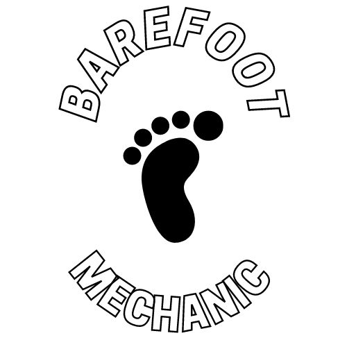

<a name="readme-top"></a>

<!--
HOW TO USE:
This is an example of how you may give instructions on setting up your project locally.

Modify this file to match your project and remove sections that don't apply.

REQUIRED SECTIONS:
- Table of Contents
- About the Project
  - Built With
  - Live Demo
- Getting Started
- Authors
- Future Features
- Contributing
- Show your support
- Acknowledgements
- License

OPTIONAL SECTIONS:
- FAQ

After you're finished please remove all the comments and instructions!
-->

<div align="center">
  <!-- You are encouraged to replace this logo with your own! Otherwise you can also remove it. -->
  
  <br/>

  <h3><b>Book an Appointment README</b></h3>

</div>

<!-- TABLE OF CONTENTS -->

# 📗 Table of Contents

- [📖 About the Project](#about-project)
  - [🛠 Built With](#built-with)
    - [Tech Stack](#tech-stack)
    - [Key Features](#key-features)
- [💻 Getting Started](#getting-started)
  - [Setup](#setup)
  - [Prerequisites](#prerequisites)
  - [Install](#install)
  - [Usage](#usage)
  - [Run tests](#run-tests)
  - [Deployment](#triangular_flag_on_post-deployment)
- [👥 Authors](#authors)
- [🔭 Future Features](#future-features)
- [🤝 Contributing](#contributing)
- [⭐️ Show your support](#support)
- [🙏 Acknowledgements](#acknowledgements)
- [❓ FAQ (OPTIONAL)](#faq)
- [📝 License](#license)

<!-- PROJECT DESCRIPTION -->

# 📖 [Bare Foot Mechanic] <a name="about-project"></a>

**[Bare Foot Mechanic]** is a Car repair appointment app built using React and Tailwind CSS on the frontend and Ruby on Rails on the backend.

## 🛠 Built With <a name="built-with"></a>

### Tech Stack <a name="tech-stack"></a>

<details>
  <summary>Client</summary>
  <ul>
    <li><a href="https://reactjs.org/">React.js</a></li>
  </ul>
</details>

<details>
  <summary>Server</summary>
  <ul>
    <li><a href="https://expressjs.com/">Express.js</a></li>
  </ul>
</details>

<details>
<summary>Database</summary>
  <ul>
    <li><a href="https://www.postgresql.org/">PostgreSQL</a></li>
  </ul>
</details>

<!-- Features -->

### Key Features <a name="key-features"></a>

- **[Create, delete, display from database]**
- **[Login with JWT]**
- **[Authorised with JWT]**

<p align="right">(<a href="#readme-top">back to top</a>)</p>

<!-- GETTING STARTED -->

## 💻 Getting Started <a name="getting-started"></a>

To get a local copy up and running, follow these steps.

### Prerequisites

In order to run this project you need:

- A Desktop or Laptop Computer running on with Windows, Mac OS or Linux operating system.
- VSCODE installed
- GitHub account
- Node.js installed
- Ruby installed (version 3.1.3 used)
- rails installed (version 7.0.4 used)
- Postgresql installed
- cmd or powershell to run the server

> Clone repository to local machine for the back-end rails

> Clone this repository link for the front-end react [REACT-FRONTEND]https://github.com/topeogunleye/appointment-front-end

### Setup

Clone this repository to your desired folder:

```sh
  cd my-folder
  git clone git@github.com:svitalis123/Book-an-Appointment.git
```

### Install

1. Install the dependencies:

```sh
  cd Book-an-Appointment
  bundle install

  (ensure rails version is the same and bundler is the same versions)
```

### Usage

To run the project, execute the following command
to start the backend server first

1. Create the database

```
rails db:create
```

2. Run the migrations

```
Run the migrations
```

3. Migrate the database

```
rails db:migrate
```

4. Seed the database

```
rails db:seed
```
5. Start the server on port 8000

```sh
  rails s -p 8000
```

After the backend is running, run the frontend

1. Clone the Front End Repo:
```sh
  git clone git@github.com:topeogunleye/appointment-front-end.git
```

2. Install the dependencies:

```sh
  cd appointement-front-end
  npm install
```

3. Start the server on port 3000

```sh
  npm start
```

### Deployment

You can deploy this project using:

https://render.com

<p align="right">(<a href="#readme-top">back to top</a>)</p>

<!-- AUTHORS -->

## 👥 Authors <a name="authors"></a>

👤 **Temitope Ogunleye**

- GitHub: [@topeogunleye](https://github.com/topeogunleye)
- Twitter: [@tope_leye](https://twitter.com/tope_leye)
- LinkedIn: [ogunleye](https://linkedin.com/in/ogunleye)

👤 **David Amon-Cofie**

- GitHub: [@amon-cofie](https://github.com/amon-cofie)
- Twitter: [@amon_cofie](https://twitter.com/amon_cofie)
- LinkedIn: [David Amon-Cofie](https://www.linkedin.com/in/david-amon-cofie-2389ab241/)

👤 **Shuhad Loofer**

- GitHub: [@Shuhad786](https://github.com/Shuhad786)
- LinkedIn: [LinkedIn](https://linkedin.com/in/shuhad-loofer)

👤 **Vitalis Mutwiri**

- GitHub: [@svitalis123](https://github.com/svitalis123)
- Twitter: [@WilsonVitalis](https://twitter.com/WilsonVitalis)
- LinkedIn: [LinkedIn](https://linkedin.com/in/vitalismutwiri)

<p align="right">(<a href="#readme-top">back to top</a>)</p>

<!-- FUTURE FEATURES -->

## 🔭 Future Features <a name="future-features"></a>

- [ ] **[Implement user authentication]**
- [ ] **[Update database with new user information]**

<p align="right">(<a href="#readme-top">back to top</a>)</p>

<!-- CONTRIBUTING -->

## 🤝 Contributing <a name="contributing"></a>

Contributions, issues, and feature requests are welcome!

Feel free to check the [issues page](https://github.com/svitalis123/Book-an-Appointment/issues).

<p align="right">(<a href="#readme-top">back to top</a>)</p>

<!-- SUPPORT -->

## ⭐️ Show your support <a name="support"></a>

Plese give a star on our repository as we worked long hours show casing our skills and would really appreciate your feedback thank you

<p align="right">(<a href="#readme-top">back to top</a>)</p>

<!-- ACKNOWLEDGEMENTS -->

## 🙏 Acknowledgments <a name="acknowledgements"></a>

The layout and color scheme was inspired by Murat Korkmaz please view his link below

Designed by:

- Murat Korkmaz
https://www.behance.net/gallery/26425031/Vespa-Responsive-Redesign

<p align="right">(<a href="#readme-top">back to top</a>)</p>

<!-- FAQ (optional) -->

## ❓ FAQ (OPTIONAL) <a name="faq"></a>

- **[How did you determine the ERB diagram]**

  - [We looked at what was needed and worked accordingly]

- **[Was it hard doing this]**

  - [Yes, it was however nothing worth struggling for comes easy]

<p align="right">(<a href="#readme-top">back to top</a>)</p>

<!-- LICENSE -->

## 📝 License <a name="license"></a>

This project is [MIT](./LICENSE) licensed.

<p align="right">(<a href="#readme-top">back to top</a>)</p>
